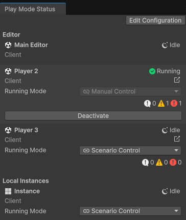
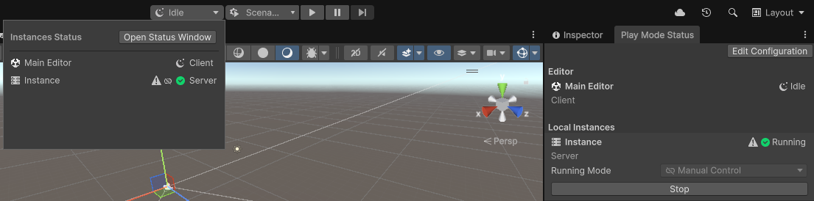

# Improve iteration speed of the Play Mode Scenarios

## Disable domain reload

The Play Mode Scenarios are compatible with domain reload.
However, the larger the project, the larger it affects the iteration time.
One way to quickly improve iteration speed, is then to disable domain reload.
To disable domain reload, go to **Edit > Project Settings > Editor**. Under **Enter Play Mode settings > When entering Play Mode** , select **Reload Scene Only** or **Do not reload Domain or Scene**.

## Select the correct running mode parameter
Free Running Instances enable users to launch instances that are independent of the scenario execution, thereby enabling more flexible workflows and faster iteration speeds. This can be done by toggling an Instance's running mode parameter and is available for both Editor, local and remote instances.

*Screen capture of the Play Mode Status window illustrating both running mode options*

### Running mode parameter options breakdown

The running mode parameter contains two options:

|**Option**|**Description**|
|-|-|
|  Scenario control|The **scenario control** option is the default behavior and means that the corresponding instance execution will be done through the play Mode button, in concert with the other scenario controlled instances. All the scenario controled instances will be launched and stopped simultaneously. |
| Manual control |The **manual control** option allows instances to run independently from the main scenario. Enabling fine tuning of what needs to be re-compiled and relaunched between different Play Mode events.|

### When to use the manual control option

This approach is beneficial when some instances require fewer updates than others, eliminating the need for full rebuilds and redeployments each time. This significantly reduces iteration time, particularly when dealing with local and remote instances that have lengthy build and deployment processes.

### Changing the running mode of an Instance
Modifying the running mode is done through the Play Mode Status window (Window > Multiplayer > Play Mode Status). 
To launch an instance independently, either press Activate for editor instances or Run for Local/remote instances.

> [!NOTE]
> The manually controlled instances are still part of the scenario and will still appear in the Play Mode Status window.
> If the streaming log option is enabled, logs will still be displayed in the console of the main Editor.

### Managing synchronization with the Editor

When iterating on your multiplayer game using Free Running Instances, you might make changes in the main Editor, such as
modifying code, scenes, or assets. These actions can cause a manually controlled running instance to become out of sync
with your project. This desynchronization is known as coherence drift, causing the game in the running instance to no
longer reflect the current game state in the main Editor. This mainly affects local and remote instances.

When coherence drift occurs, a drift warning icon appears in the Play Mode Status window and Play Mode pop-up window.
Restart the affected instance to resolve the drift and ensure the running instance reflects your latest changes.

